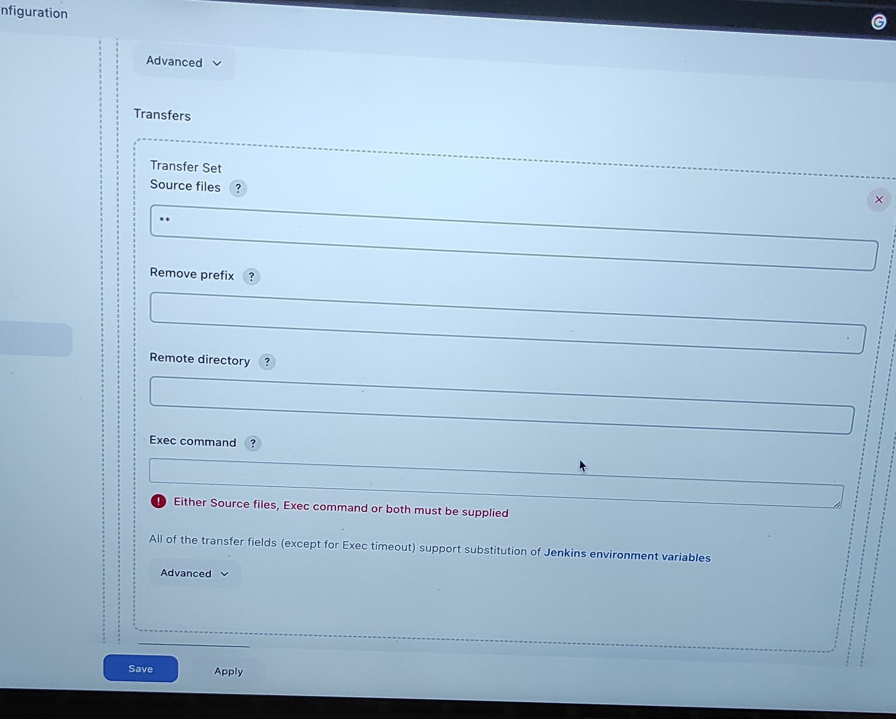

# AUTOMATING TOOLING WEBSITE DEPLOYMENT WITH CONTINOUS INTEGRATION(CI)-JENKINS

In [Project-8](https://github.com/Olaminiyi/Project-8/blob/main/README.md), we introduced horizontal scalability concept, which allow us to add new Web Servers to our Tooling Website and we successfully deployed a set up with 2 Web Servers and also a Load Balancer to distribute traffic between them. It is not a big deal to configure two 0r three servers manually. Imagine that you would need to repeat the same task over and over again adding dozens or even hundreds of servers.

DevOps is about Agility, speedy release of software and web solutions. One of the ways to guarantee fast and repeatable deployments is Automation of routine tasks.

In this project we are going to automate part of our routine tasks with a free and open source automation tool – **Jenkins**.

**Continuous integration** is a DevOps software development practice where developers regularly merge their code changes into a central repository, after which automated builds and tests are run. **Continuous integration** most often refers to the build or integration stage of the software release process and entails both an automation component (e.g. a CI or build service) and a cultural component (e.g. learning to integrate frequently). The key goals of continuous integration are to **find and address bugs quicker, improve software quality, and reduce the time it takes to validate and release new software updates**.

According to Circle CI, Continuous integration (CI) is a software development strategy that increases the speed of development while ensuring the quality of the code that teams deploy. Developers continually commit code in small increments (at least daily, or even several times a day), which is then automatically built and tested before it is merged with the shared repository.

In our project we are going to utilize Jenkins CI capabilities to make sure that every change made to the source code in [my GitHub](https://github.com/Olaminiyi/tooling) will automatically be updated to the Tooling Website.

Our 3 tier achitecture will look like this


### INSTALL AND CONFIGURE JENKINS SERVER

Create an AWS EC2 server based on Ubuntu Server 20.04 LTS and name it “Jenkins”


Connect to the EC2 instance using this command
```
ssh -i <yourkey.pem> ec2-user@<public-ip-address>
```
Install JDK (since Jenkins is a Java-based application)
```
sudo apt update
```
```
sudo apt install default-jdk-headless
```
  


### Install Jenkins
```
wget -q -O - https://pkg.jenkins.io/debian-stable/jenkins.io.key | sudo apt-key add -
sudo sh -c 'echo deb https://pkg.jenkins.io/debian-stable binary/ > \
   /etc/apt/sources.list.d/jenkins.list'
sudo apt update
sudo apt-get install jenkins
```


Make sure Jenkins is up and running
  


By default `Jenkins` server uses TCP `port 8080` – open it by creating a new Inbound Rule in your `EC2 Security Group`
   


Perform initial Jenkins setup.
   
From your browser access **http://<Jenkins-Server-Public-IP-Address-or-Public-DNS-Name>:8080**

You will be prompted to provide a default admin password


```
sudo cat /var/lib/jenkins/secrets/initialAdminPassword
```
f1b9a07a912c483c843f06d127a121f8


Once plugins installation is done – create an `admin user` and you will get your Jenkins server address.


### Step 2 – Configure Jenkins to retrieve source codes from GitHub using Webhooks

Enable webhooks in your GitHub repository settings


Go to Jenkins web console, click “New Item” and create a “Freestyle project”


In configuration of your Jenkins freestyle project choose `Git repository`, provide there the link to your Tooling GitHub repository and credentials (user/password) so Jenkins could access files in the repository.


Save the configuration and let us try to run the build. For now we can only do it manually.
Click **“Build Now” button,** if you have configured everything correctly, the build will be successfull and you will see it under `#1`


But this build does not produce anything and it runs only when we trigger it manually. Let us fix it.

Click `Configure` your job/project and add these two configurations
Configure triggering the job from GitHub webhook:


Now, go ahead and make some change in any file in your GitHub repository (e.g. README.MD file) and push the changes to the master branch.

You will see that a new build has been launched automatically (by webhook) and you can see its results – `artifacts`, saved on `Jenkins server`.


### Step 3 – Configure Jenkins to copy files to NFS server via SSH

Now we have our artifacts saved locally on Jenkins server, the next step is to copy them to our NFS server to `/mnt/apps`directory.

Jenkins is a highly extendable application and there are 1400+ plugins available. We will need a plugin that is called “Publish Over SSH”.

Install “Publish Over SSH” plugin.


Configure the job/project to copy artifacts over to NFS server.
On main dashboard select `Manage Jenkins` and choose `Configure System` menu item.

Scroll down to Publish over SSH plugin configuration section and configure it to be able to connect to your NFS server:


Add post build action to `send build artifacts over ssh`.

To copy all the files and directories.. we use `**`



Save configuration and updte README.MD file. The webhook will triger a new job


When we click on the new job and access the console output we should see the following at the end of the build information.

```
SSH: Transferred 25 file(s)
Finished: SUCCESS
```
To make sure that the files in /mnt/apps have been updated, connect to the NFS server through a terminal and check README.MD file.

```
sudo cat /mnt/apps/README.md
```

