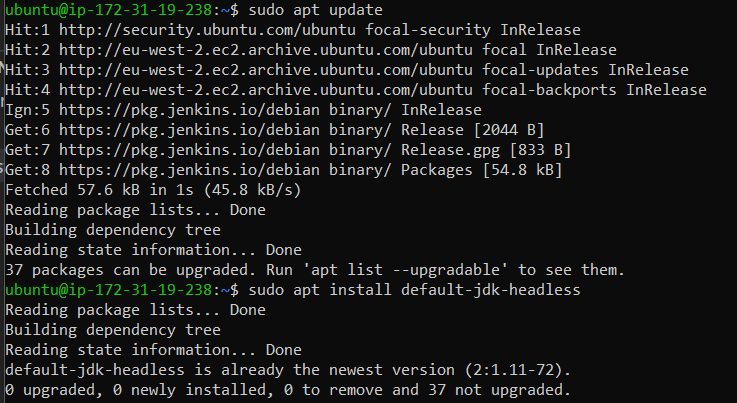
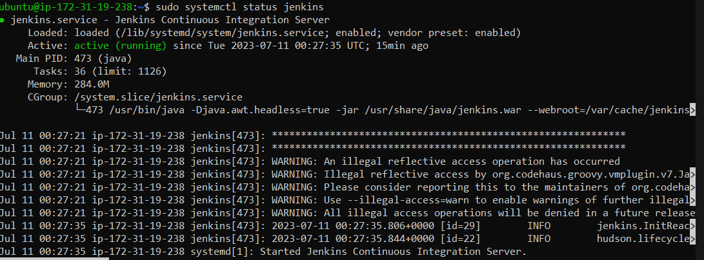
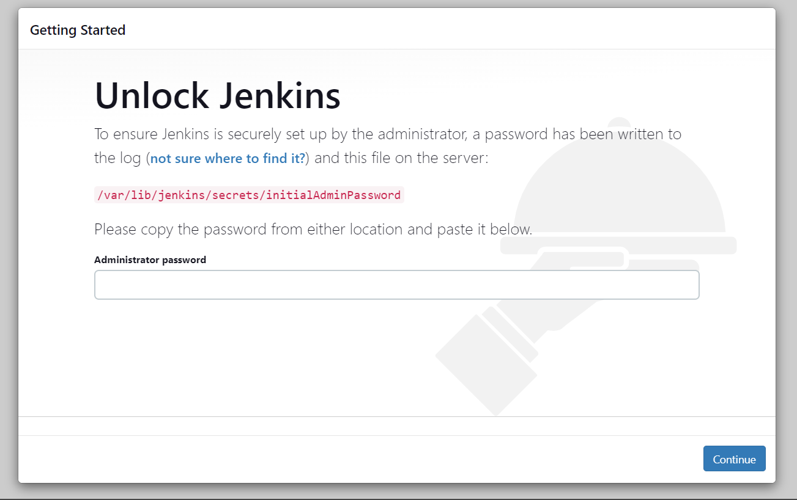
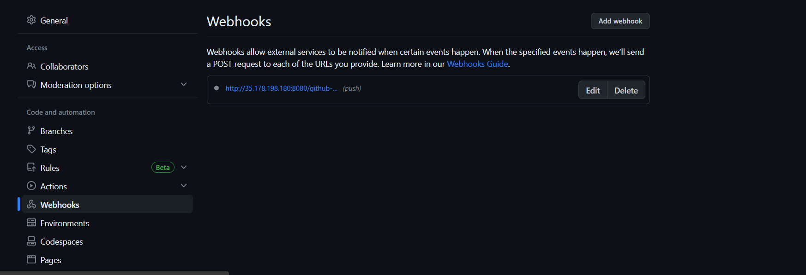
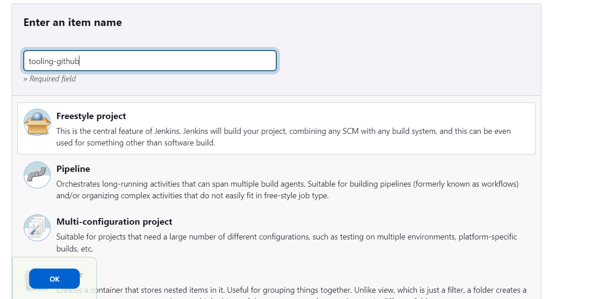
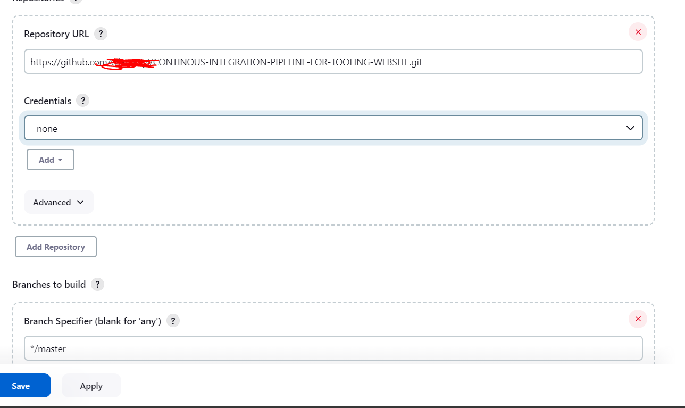
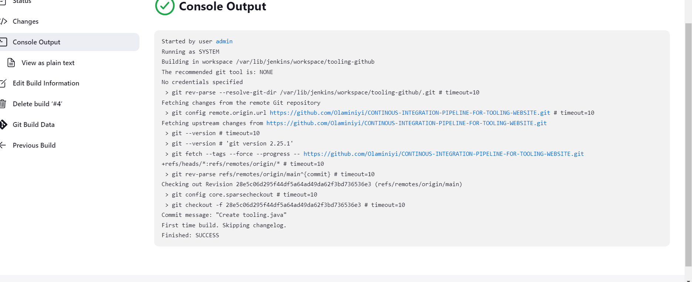
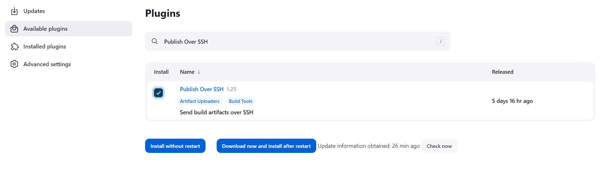
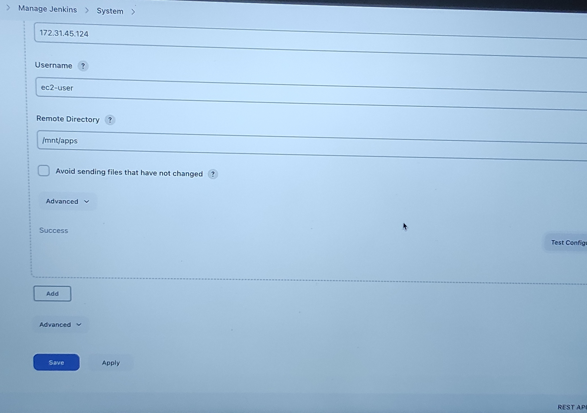
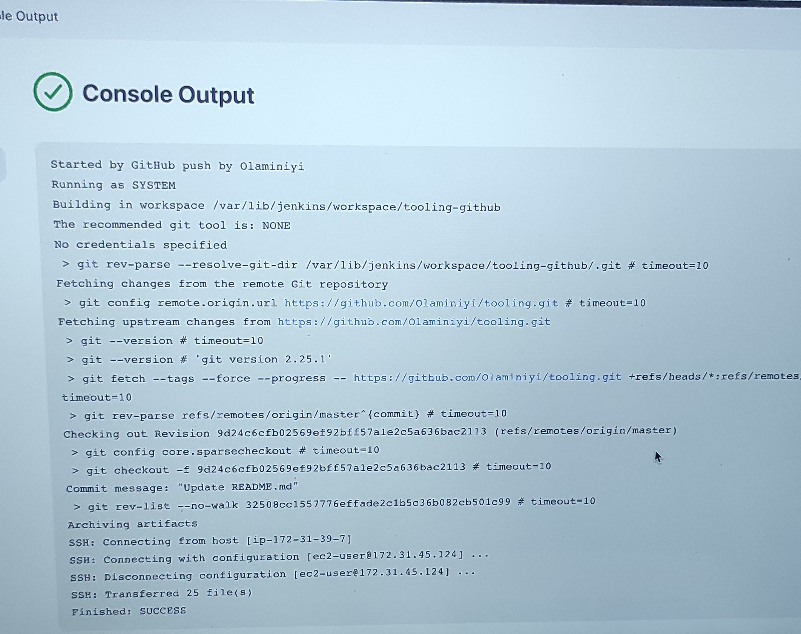

1. Create an AWS EC2 server based on Ubuntu Server 20.04 LTS and name it “Jenkins”
   

2. Install JDK (since Jenkins is a Java-based application)

- sudo apt update
- sudo apt install default-jdk-headless
  

3. Install Jenkins

- wget -q -O - https://pkg.jenkins.io/debian-stable/jenkins.io.key | sudo apt-key add -
- sudo sh -c 'echo deb https://pkg.jenkins.io/debian-stable binary/ > \
   /etc/apt/sources.list.d/jenkins.list'
- sudo apt update
- sudo apt-get install jenkins
  

- Make sure Jenkins is up and running
  

4. By default Jenkins server uses TCP port 8080 – open it by creating a new Inbound Rule in your EC2 Security Group
   

5. Perform initial Jenkins setup.
   From your browser access http://<Jenkins-Server-Public-IP-Address-or-Public-DNS-Name>:8080

You will be prompted to provide a default admin password

- sudo cat /var/lib/jenkins/secrets/initialAdminPassword
- f1b9a07a912c483c843f06d127a121f8
  

- Once plugins installation is done – create an admin user and you will get your Jenkins server address.
  
  

6.  Step 2 – Configure Jenkins to retrieve source codes from GitHub using Webhooks

- Enable webhooks in your GitHub repository settings
  

- Go to Jenkins web console, click “New Item” and create a “Freestyle project”
  

- In configuration of your Jenkins freestyle project choose Git repository, provide there the link to your Tooling GitHub repository and credentials (user/password) so Jenkins could access files in the repository.
  

- Save the configuration and let us try to run the build. For now we can only do it manually.
  Click “Build Now” button, if you have configured everything correctly, the build will be successfull and you will see it under #1
  

7. But this build does not produce anything and it runs only when we trigger it manually. Let us fix it.

- Click “Configure” your job/project and add these two configurations
- Configure triggering the job from GitHub webhook:
  

- Now, go ahead and make some change in any file in your GitHub repository (e.g. README.MD file) and push the changes to the master branch.

You will see that a new build has been launched automatically (by webhook) and you can see its results – artifacts, saved on Jenkins server.

6. Step 3 – Configure Jenkins to copy files to NFS server via SSH

- Now we have our artifacts saved locally on Jenkins server, the next step is to copy them to our NFS server to /mnt/apps directory.

Jenkins is a highly extendable application and there are 1400+ plugins available. We will need a plugin that is called “Publish Over SSH”.

- Install “Publish Over SSH” plugin.
  

7. Configure the job/project to copy artifacts over to NFS server.
   On main dashboard select “Manage Jenkins” and choose “Configure System” menu item.

Scroll down to Publish over SSH plugin configuration section and configure it to be able to connect to your NFS server:

8. add post build action to "send build artifacts over ssh".

- to copy all the files and directories.. we use \*\*
  

9. Save configuration and updte README.MD file. The webhook will triger a new job
   
